# 朗語

朗語 is a native Android app for language shadowing and choursing practice. It brings local media playback, YouTube import, subtitle timing, dictionary lookup, and voice recording feedback into one study-focused player.

[Download the latest release](https://github.com/kaihouguide/rougo/releases/latest)

## Screenshots

| Library | YouTube Browsing | Player + Subtitles |
|:---:|:---:|:---:|
| 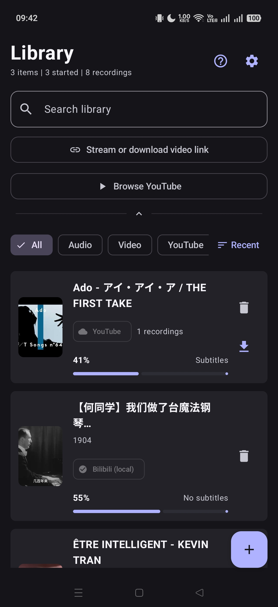 | 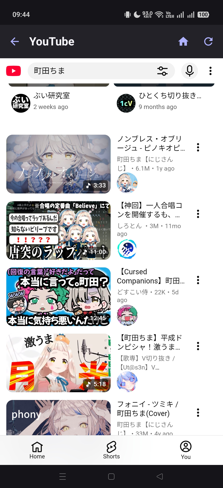 | 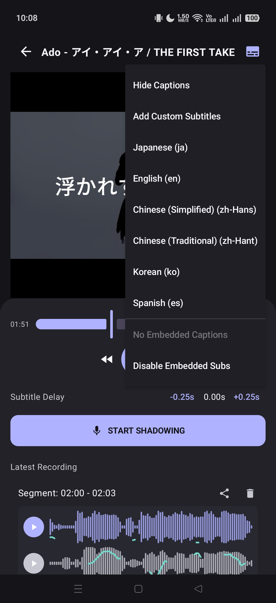 |

| Shadowing | Dictionary Lookup | Settings |
|:---:|:---:|:---:|
| 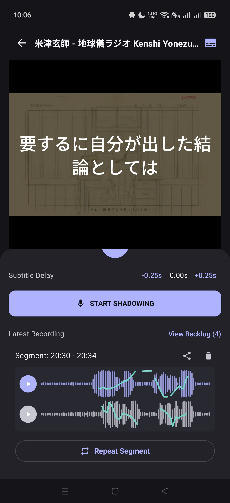 | 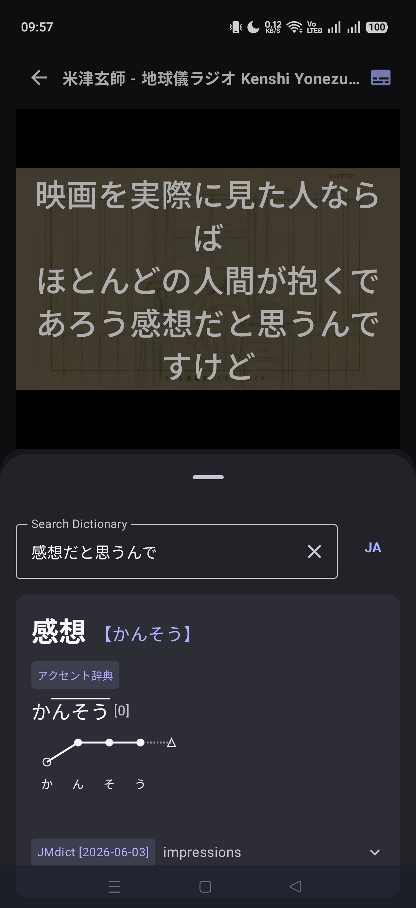 | 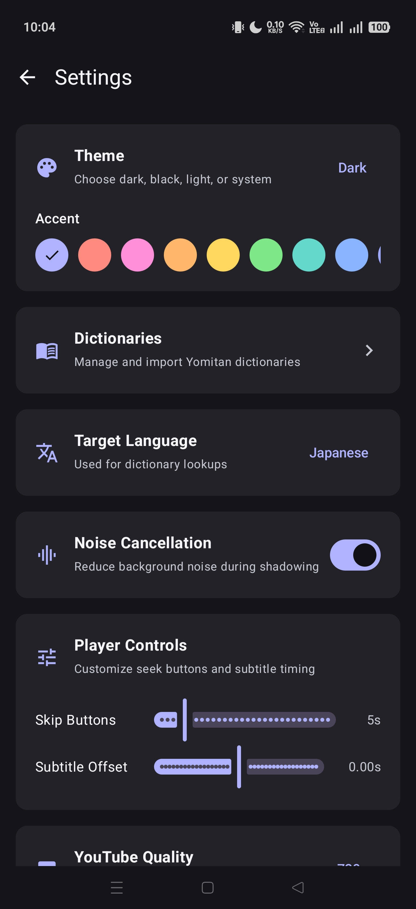 |

| Color Themes |
|:---:|
| 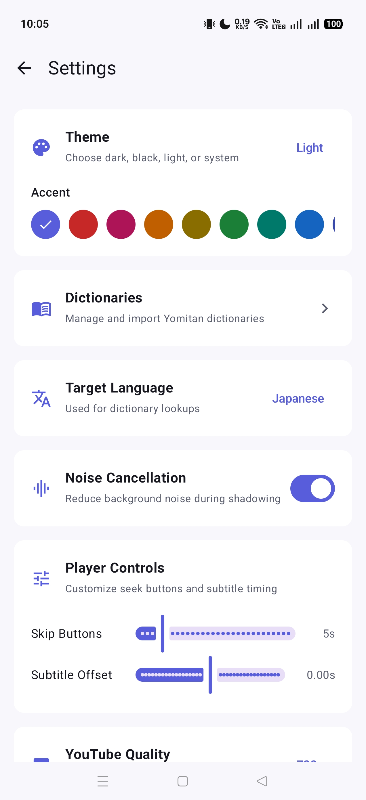 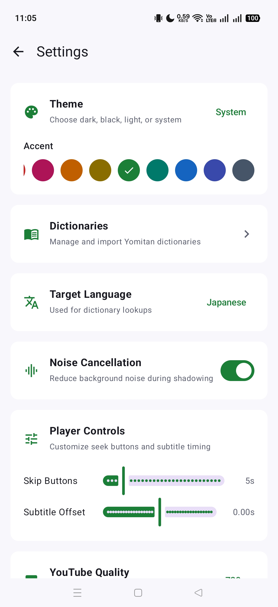 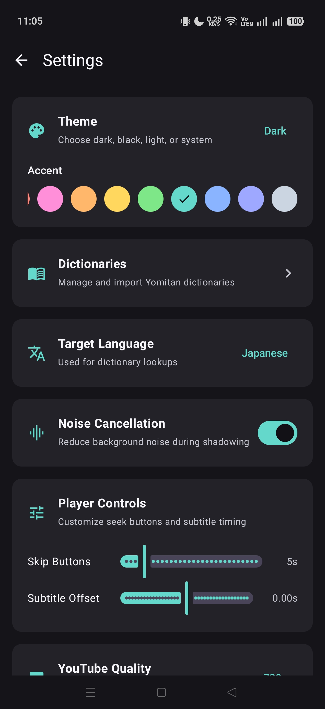 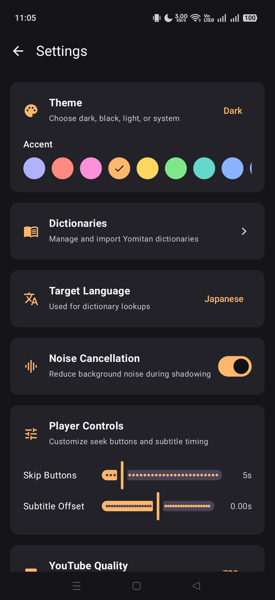 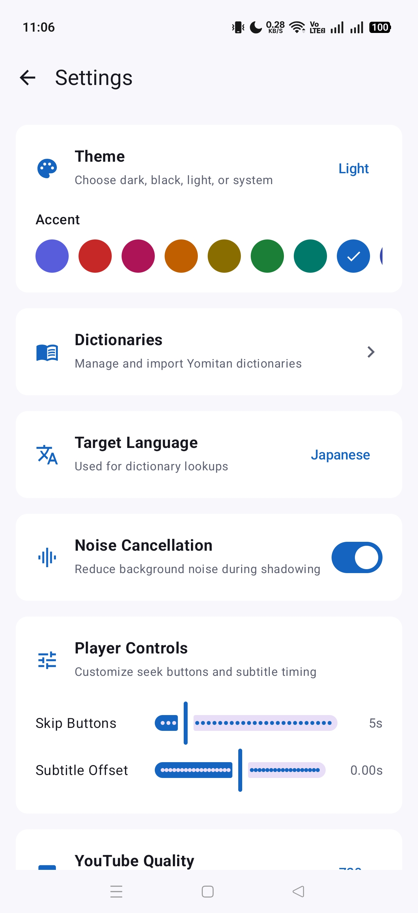 |

## Highlights

- Local audio and video library with progress tracking, search, filters, recordings, and subtitle status.
- VLC-backed playback for common audio and video formats, including M4B audiobook metadata and cover art.
- In-app YouTube browsing plus sharing/import with selectable quality and optional automatic subtitles.
- Subtitle controls for delay adjustment, custom subtitle import, embedded subtitle toggling, and language selection.
- Shadowing mode with recording playback, original audio playback, repeat segments, waveform comparison, and visual feedback.
- Built-in dictionary workflow with Yomitan-style dictionary import, language-aware lookup, and pitch dictionary support.
- Settings for themes, accent colors, target language, noise cancellation, skip buttons, subtitle offset, and YouTube quality.
- Crash reporting that saves the last crash details for later diagnosis.

## Installation

1. Open the [latest release](https://github.com/kaihouguide/rougo/releases/latest).
2. Download the APK that matches your device architecture.
   - Most modern Android phones use `app-arm64-v8a-release.apk`.
   - Android emulators may need `x86` or `x86_64`.
3. Install the APK on your Android device.
4. Open 朗語 and add local media, or share a YouTube link into the app.

## Building

### Requirements

- Android Studio
- JDK 21
- Android SDK 36
- Android NDK for the native dictionary module

### Local Build

```bash
git clone https://github.com/kaihouguide/rougo.git
cd rougo
./gradlew :app:assembleRelease
```

Release APKs are generated under:

```text
app/build/outputs/apk/release/
```

## Releases

GitHub Actions builds release APKs from version tags such as `V2.7`. Published releases include separate APKs for `arm64-v8a`, `armeabi-v7a`, `x86`, and `x86_64`.

## License

This project is licensed under the GNU General Public License v3.0. See [LICENSE](LICENSE) for details.

## Thanks

I will always be thankful for Manhhao and Nautics for giving me a chance to make this app a reality.

Pull requests and help with the app are always appreciated.
